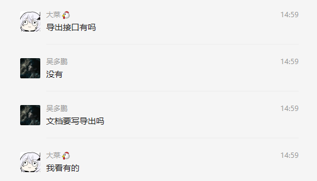
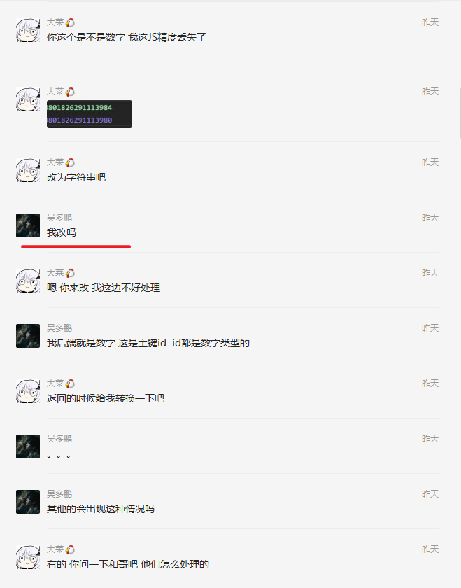

1. 接口返回数据随意改动 导致UI渲染出现异常 经检查UI源码发现问题是接口数据改动问题[👎](https://emojipedia.org/thumbs-down/)[👎](https://emojipedia.org/thumbs-down/)

2. 导出接口联调三天 竟然不知道要导出[👎](https://emojipedia.org/thumbs-down/)

    

3. 接口修改不通知前端自己改完就不管[👎](https://emojipedia.org/thumbs-down/)[👎](https://emojipedia.org/thumbs-down/)[👎](https://emojipedia.org/thumbs-down/)[👎](https://emojipedia.org/thumbs-down/)[👎](https://emojipedia.org/thumbs-down/)

4. 写完的接口查询详情除了 id 还要传 code 不知道怎么想的

5. id 前端这里丢失精度 感觉不是很乐意改[👎](https://emojipedia.org/thumbs-down/)

    

6. 布尔值没处理直接 0 1 抛给我 （让他改了

7. 查询 & 创建 & 更新单据均需要跑两个接口
    1） 该是改了 然后查看上述第三条 改了不说得你自己去试

